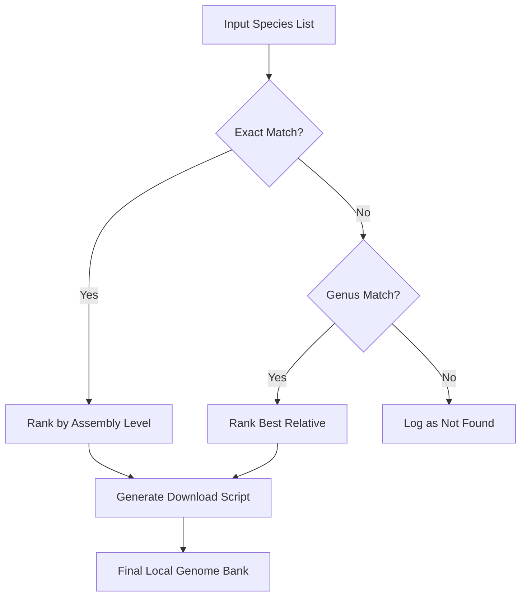

# TaxoFetch: Taxonomy-Aware Genome Downloader 🧬

[](https://www.python.org/downloads/)
[](https://opensource.org/licenses/MIT)

**TaxoFetch** is a command-line tool designed for high-throughput genome acquisition from NCBI. It is specifically built for researchers working with **weeds, wild relatives, or non-model insects** where high-quality reference genomes for a specific species might be missing.

## 🌟 Why TaxoFetch?

Standard NCBI downloaders often fail if a specific species name doesn't have a perfect match in the database. TaxoFetch solves this by implementing a **Taxonomic Fallback Strategy**:

1.  **Exact Match:** Searches for the specific species (e.g., *Amaranthus palmeri*).
2.  **Genus Fallback:** If not found, it automatically identifies the highest-quality assembly within the same Genus (e.g., *Amaranthus hypochondriacus*) to serve as a proxy.
3.  **Cross-Database Search:** It scans both **RefSeq** (NCBI-curated) and **GenBank** (author-submitted) to ensure you don't miss available data.

## 💡 Motivation
TaxoFetch was created at the request of my lab mate, Émilie Beauregard, who needed a way to automatically find related proxy genomes for insects when a specific species assembly is unavailable.

## 🛠 Workflow



## 📦 Installation

```bash
# Clone the repo
git clone https://github.com/poursalavati/TaxoFetch.git
cd TaxoFetch

# Install dependencies
pip install pandas
```

## 🚀 Quick Start

1. Create a `species.txt` file:
   ```text
   Arabidopsis thaliana
   Solanum lycopersicum
   Amaranthus palmeri
   ```

2. Run the fetcher for plants:
   ```bash
   python taxofetch.py -i species.txt -g plant -s both
   ```

3. Start the download:
   ```bash
   bash run_downloads_plant.sh
   ```

## ⚙️ Arguments

| Flag | Description |
| :--- | :--- |
| `-i`, `--input` | Path to a text file containing scientific names (one per line). |
| `-g`, `--group` | The taxonomic group. Options: `plant`, `invertebrate`, `bacteria`, `fungi`, `vertebrate`, etc. |
| `-s`, `--source` | Database preference. Options: `refseq`, `genbank`, or `both` (Default: `both`). |
| `-o`, `--outdir` | (Optional) Custom output directory for downloaded files. |
| `--clean` | (Optional) Force re-download of the NCBI assembly summary catalogs. |


## 📊 Output
The tool produces a `download_report_[group].log`. This file is crucial for reproducibility, as it records exactly which substitute species were used when a fallback occurred.

| Target_Species | Status | Source | Accession |
| :--- | :--- | :--- | :--- |
| *Amaranthus palmeri* | FALLBACK (*A. hyponchondriacus*) | REFSEQ | GCF_002176835.1 |


## ⬇️ Downloading
The script generates a **Bash script** (e.g., `run_downloads_plant.sh`) to perform the actual downloading. This allows you to review the plan before using bandwidth.

```bash
# 1. Generate the plan
python taxofetch.py -i list.txt -g plant

# 2. Execute the download
bash run_downloads_plant.sh
```

## 📂 Output Structure

The tool keeps your workspace clean:

```text
/
├── taxofetch.py
├── assembly_summary_plant.txt    # Cached NCBI catalog
├── download_report_plant.log     # Detailed audit trail
├── run_downloads_plant.sh        # The download script
└── plant_genomes/                # The actual downloaded .fna.gz files
    ├── GCF_0001.fna.gz
    └── GCA_0002.fna.gz
```

## 🤝 Contributing
Contributions are welcome! If you have ideas for improving the ranking logic or adding support for higher taxonomic levels (Family/Order), please open an issue or a PR.

## 📜 License
Distributed under the MIT License. See `LICENSE` for more information.

